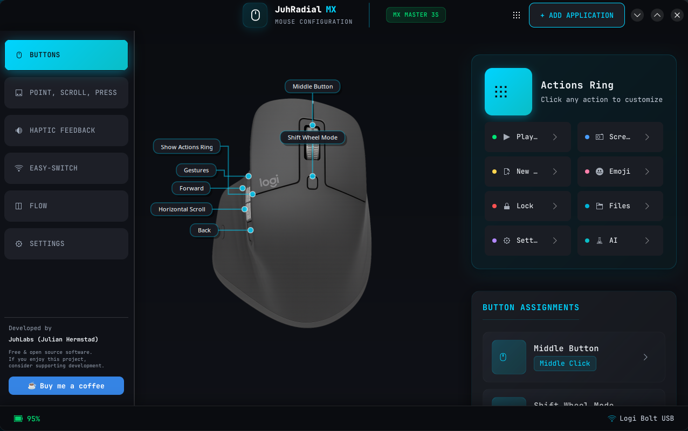
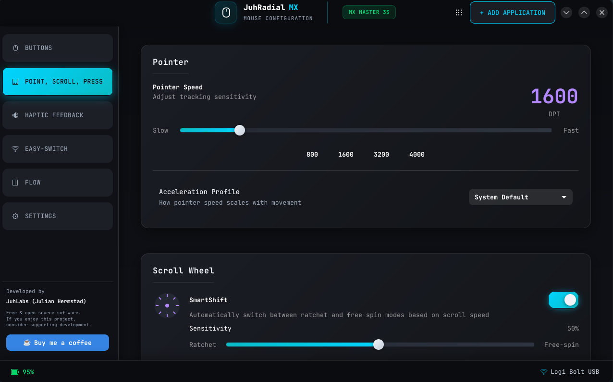

<div align="center">
  
  <h1>JuhRadial MX</h1>
  <p><strong>Beautiful radial menu for Logitech MX Master mice on Linux</strong></p>
  <p>A Logi Options+ inspired experience for KDE Plasma</p>

  <!-- Badges -->
  <p>
    <a href="https://github.com/JuhLabs/juhradial-mx/actions/workflows/ci.yml">
      
    </a>
    <a href="https://github.com/JuhLabs/juhradial-mx/actions/workflows/security.yml">
      
    </a>
    <a href="LICENSE">
      
    </a>
    <a href="https://github.com/JuhLabs/juhradial-mx/releases/latest">
      
    </a>
  </p>
</div>

---

## Screenshots

<div align="center">
  <table>
    <tr>
      <td align="center">
        
        <br><em>Glassmorphic Radial Menu</em>
      </td>
      <td align="center">
        
        <br><em>Settings Dashboard</em>
      </td>
    </tr>
    <tr>
      <td align="center">
        
        <br><em>DPI & Scroll Settings</em>
      </td>
      <td align="center">
        
        <br><em>Interactive Mouse Visualization</em>
      </td>
    </tr>
  </table>
</div>

## Features

- **Glassmorphic Radial Menu** - Beautiful, modern overlay triggered by gesture button
- **Per-App Profiles** - Customize actions for different applications
- **Battery Monitoring** - Real-time battery status via HID++ protocol
- **DPI Control** - Visual DPI slider with presets (400-8000 DPI)
- **SmartShift Settings** - Configure scroll wheel ratchet/free-spin behavior
- **Haptic Feedback** - Feel confirmation when selecting menu items
- **Catppuccin Theme** - Dark, elegant Catppuccin Mocha color scheme
- **Native KDE Integration** - Seamless Wayland support via KWin scripting

## Critical Design Principle

**No onboard memory writes.** JuhRadial MX never modifies your mouse's internal storage. Your MX Master remains 100% compatible with Logi Options+ on Windows/macOS.

## Supported Devices

- Logitech MX Master 4
- Logitech MX Master 3S
- Logitech MX Master 3
- Logitech MX Master 2S

## Requirements

- **Linux** with KDE Plasma 6
- **Wayland** display server (X11 partially supported)
- **logiops** for button mapping
- **ydotool** for cursor capture (optional)

## Installation

### Flatpak (Recommended)

```bash
flatpak install flathub org.juhlabs.JuhRadialMX
```

### Fedora (COPR)

```bash
sudo dnf copr enable juhlabs/juhradial-mx
sudo dnf install juhradial-mx
```

### Arch Linux (AUR)

```bash
yay -S juhradial-mx
# or
paru -S juhradial-mx
```

### From Source

```bash
# Install dependencies (Fedora)
sudo dnf install rust cargo nodejs npm \
  gtk4-layer-shell-devel python3-gobject python3-cairo \
  dbus-devel systemd-devel logiops

# Clone and build
git clone https://github.com/JuhLabs/juhradial-mx
cd juhradial-mx
make build
sudo make install

# Enable and start
systemctl --user enable --now juhradialmx-daemon
```

### Universal Installer

```bash
curl -fsSL https://raw.githubusercontent.com/JuhLabs/juhradial-mx/master/install.sh | bash
```

## Quick Start

1. **Install logiops** and configure the gesture button:
   ```bash
   sudo dnf install logiops  # Fedora
   sudo systemctl enable --now logid
   ```

2. **Start JuhRadial MX**:
   - From application menu, or
   - Run `juhradial-mx` in terminal

3. **Configure**:
   - Right-click tray icon > Settings
   - Customize radial menu actions
   - Adjust DPI and scroll settings

4. **Use**:
   - Press and hold the gesture button (thumb button)
   - Move mouse to select action
   - Release to execute

## Configuration

Configuration is stored in `~/.config/juhradial/config.json`.

### Key Bindings

| Button | Default Action |
|--------|----------------|
| Gesture Button (hold) | Open Radial Menu |
| Forward | Browser Forward |
| Back | Browser Back |
| Middle Click | Middle Click |
| Thumb Wheel | Horizontal Scroll |

## Project Structure

```
juhradial-mx/
├── daemon/           # Rust daemon (input handling, D-Bus, battery)
├── overlay/          # Python GTK4 overlay & settings
├── kwin-script/      # TypeScript KWin integration
├── widget/           # QML Plasma widget
├── assets/           # Icons, images
├── packaging/        # Distribution files
└── scripts/          # Helper scripts
```

## Contributing

Contributions are welcome! Please read our [Contributing Guide](CONTRIBUTING.md) before submitting a Pull Request.

### Development

```bash
# Build
make build

# Run tests
make test

# Lint
make lint
```

## Support the Project

If you find JuhRadial MX useful, consider supporting development:

<a href="https://paypal.me/LangbachHermstad">
  
</a>

## License

This project is licensed under the **GNU General Public License v3.0** - see the [LICENSE](LICENSE) file for details.

## Acknowledgments

- [logiops](https://github.com/PixlOne/logiops) - Logitech device configuration
- [Catppuccin](https://github.com/catppuccin/catppuccin) - Beautiful color scheme
- KDE Plasma team for excellent Wayland support

---

<div align="center">

**Made with love by [JuhLabs](https://github.com/JuhLabs) (Julian Hermstad)**

</div>

---

## Disclaimer

> **This project is not affiliated with, endorsed by, or sponsored by Logitech International S.A.**
>
> "Logitech", "MX Master", "Logi Options+", and related names and logos are trademarks or registered trademarks of Logitech International S.A. This is an independent, open-source project created by the community to provide Linux users with radial menu functionality.
>
> JuhRadial MX does not modify your mouse's onboard memory or firmware. It operates purely at the software level, ensuring your device remains fully compatible with official Logitech software on other operating systems.
