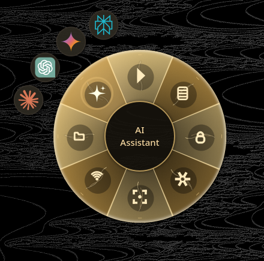
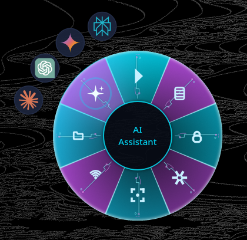

<div align="center">
  
  <h1>JuhRadial MX</h1>
  <p><strong>Beautiful radial menu for Logitech MX Master mice on Linux</strong></p>
  <p>A Logi Options+ inspired experience for KDE Plasma 6 & Hyprland</p>
  <p>IN PROGRESS: Translations and more radial designs/theme colors</p>
  
  <p>
    <a href="https://github.com/JuhLabs/juhradial-mx/releases">
      
    </a>
    <a href="https://github.com/JuhLabs/juhradial-mx/actions/workflows/ci.yml">
      
    </a>
    <a href="https://github.com/JuhLabs/juhradial-mx/actions/workflows/security.yml">
      
    </a>
    <a href="LICENSE">
      
    </a>
  </p>

  <p>
    <strong>✨ <a href="CHANGELOG.md">v0.2.7</a></strong> - Hyprland/runtime fixes, translated radial labels, and new application profile grid editing. <a href="#installation">Update now</a>. If you hit issues, please report them on <a href="https://github.com/JuhLabs/juhradial-mx/issues">GitHub</a>.
  </p>
</div>

---

## Screenshots

<div align="center">
  <table>
    <tr>
      <td align="center">
        
        <br><em>Radial Menu</em>
      </td>
      <td align="center">
        
        <br><em>3D Neon</em>
      </td>
      <td align="center">
        
        <br><em>3D Blossom</em>
      </td>
    </tr>
    <tr>
      <td colspan="3" align="center">
        
        <br><em>Settings Dashboard</em>
      </td>
    </tr>
    <tr>
      <td colspan="3" align="center">
        
        <br><em>DPI & Scroll Configuration</em>
      </td>
    </tr>
  </table>
</div>

## Media Kit

- `assets/github/githubheader.png` (1536x1024)
- `assets/github/hero-v3.png` (1600x900)
- `assets/github/banner-v3.png` (1600x360)
- `assets/github/og-v3.png` (1280x640)

## Features

- **Radial Menu** - Beautiful overlay triggered by gesture button (hold or tap)
- **AI Quick Access** - Submenu with Claude, ChatGPT, Gemini, and Perplexity
- **Multiple Themes** - JuhRadial MX, Catppuccin, Nord, Dracula, and light themes
- **Settings Dashboard** - Modern GTK4/Adwaita settings app with Actions Ring configuration
- **Easy-Switch** - Quick host switching with real-time paired device names via HID++
- **Flow** - Multi-computer control with clipboard sync (inspired by Logi Options+ Flow)
- **Battery Monitoring** - Real-time battery status with instant charging detection via HID++
- **DPI Control** - Visual DPI adjustment (400-8000 DPI)
- **Native Wayland** - Full support for KDE Plasma 6 and Hyprland

## Supported Devices

| Device | Status |
|--------|--------|
| Logitech MX Master 4 | Fully supported |
| Logitech MX Master 3S | Fully supported |
| Logitech MX Master 3 | Fully supported |

---

## Installation

### One-Line Install (Recommended)

```bash
curl -fsSL https://raw.githubusercontent.com/JuhLabs/juhradial-mx/master/install.sh | bash
```

This script will detect your distro, install dependencies, build from source, and configure everything.

### Manual Install - Fedora

```bash
# 1. Install dependencies
sudo dnf install rust cargo logiops python3-pyqt6 qt6-qtsvg \
    python3-gobject gtk4 libadwaita dbus-devel hidapi-devel

# 2. Clone and build
git clone https://github.com/JuhLabs/juhradial-mx.git
cd juhradial-mx
cd daemon && cargo build --release && cd ..

# 3. Configure logiops (maps haptic button to F19)
sudo cp packaging/logid.cfg /etc/logid.cfg
sudo systemctl enable --now logid

# 4. Run
./juhradial-mx.sh
```

### Manual Install - Arch Linux

```bash
# 1. Install dependencies
sudo pacman -S rust python-pyqt6 qt6-svg python-gobject gtk4 libadwaita
yay -S logiops  # or paru -S logiops

# 2. Clone and build
git clone https://github.com/JuhLabs/juhradial-mx.git
cd juhradial-mx
cd daemon && cargo build --release && cd ..

# 3. Configure logiops
sudo cp packaging/logid.cfg /etc/logid.cfg
sudo systemctl enable --now logid

# 4. Run
./juhradial-mx.sh
```

### Requirements

- **Wayland compositor** (KDE Plasma 6, Hyprland, or other wlroots-based)
- **logiops** (logid) for button mapping
- **Rust** (for building)
- **Python 3** with PyQt6 and GTK4/Adwaita
- **XWayland** (for overlay window positioning)

---

## Usage

**Hold mode:** Press and hold gesture button → drag to select → release to execute

**Tap mode:** Quick tap gesture button → menu stays open → click to select

### Default Actions (clockwise from top)

| Position | Action |
|----------|--------|
| Top | Play/Pause |
| Top-Right | New Note |
| Right | Lock Screen |
| Bottom-Right | Settings |
| Bottom | Screenshot |
| Bottom-Left | Emoji Picker |
| Left | Files |
| Top-Left | AI (submenu) |

---

## Autostart

```bash
# Add to KDE autostart
cp juhradial-mx.desktop ~/.config/autostart/
sed -i "s|Exec=.*|Exec=$(pwd)/juhradial-mx.sh|" ~/.config/autostart/juhradial-mx.desktop
```

---

## Configuration

Configuration is stored in `~/.config/juhradial/config.json`.

### Themes

Open Settings and select a theme:
- **JuhRadial MX** (default) - Premium dark theme with vibrant cyan accents
- Catppuccin Mocha - Soothing pastel theme with lavender accents
- Catppuccin Latte - Light pastel theme
- Nord - Arctic, north-bluish palette
- Dracula - Dark theme with vibrant colors
- Solarized Light - Precision colors for machines and people
- GitHub Light - Clean light theme

---

## Hyprland Setup

**Automatic:** The installer detects Hyprland and configures window rules automatically.

**Manual:** If needed, add these rules to your `hyprland.conf` or `custom/rules.conf`:

```conf
# JuhRadial MX overlay window rules
windowrulev2 = float, title:^(JuhRadial MX)$
windowrulev2 = noblur, title:^(JuhRadial MX)$
windowrulev2 = noborder, title:^(JuhRadial MX)$
windowrulev2 = noshadow, title:^(JuhRadial MX)$
windowrulev2 = pin, title:^(JuhRadial MX)$
windowrulev2 = noanim, title:^(JuhRadial MX)$
```

These rules ensure the radial menu overlay appears correctly on all workspaces without animations or decorations.

---

## Troubleshooting

| Problem | Solution |
|---------|----------|
| Menu doesn't appear | Check logid: `sudo systemctl status logid` |
| Wrong cursor position | Ensure you're on Wayland, not X11 |
| Mouse not detected | Restart logid: `sudo systemctl restart logid` |
| Build fails | Install dev packages: `hidapi-devel`, `dbus-devel` |
| Hyprland: Menu hidden | Add window rules from Hyprland Setup section above |
| Hyprland: Cursor not found | Ensure `hyprctl cursorpos` works in terminal |

### Debug Mode

```bash
# Run daemon with verbose output
./daemon/target/release/juhradiald --verbose
```

---

## Project Structure

```
juhradial-mx/
├── daemon/              # Rust daemon (F19 listener, D-Bus, HID++)
├── overlay/             # Python UI (PyQt6 radial menu + GTK4 settings)
├── assets/              # Icons and screenshots
└── packaging/           # logid.cfg, systemd, udev rules
```

---

## Contributing

Contributions are welcome! See [CONTRIBUTING.md](CONTRIBUTING.md) for guidelines.

---

## License

GNU General Public License v3.0 - see [LICENSE](LICENSE)

---

## Acknowledgments

- [logiops](https://github.com/PixlOne/logiops) - Logitech device configuration
- [logitech-flow-kvm](https://github.com/coddingtonbear/logitech-flow-kvm) by Adam Coddington - Flow multi-computer control inspiration
- [Catppuccin](https://github.com/catppuccin/catppuccin) - Beautiful color scheme

---

## Disclaimer

This project is **not affiliated with, endorsed by, or associated with Logitech** in any way. "Logitech", "MX Master", "Logi Options+", and related names are trademarks of Logitech International S.A. This is an independent, open-source project created by the community for the community.

---

## Star History

<div align="center">
  <a href="https://star-history.com/#JuhLabs/juhradial-mx&Date">
    <picture>
      <source media="(prefers-color-scheme: dark)" srcset="https://api.star-history.com/svg?repos=JuhLabs/juhradial-mx&type=Date&theme=dark" />
      <source media="(prefers-color-scheme: light)" srcset="https://api.star-history.com/svg?repos=JuhLabs/juhradial-mx&type=Date" />
      
    </picture>
  </a>
</div>

> If you find JuhRadial MX useful, consider giving it a star — it helps others discover the project!

---

<div align="center">

**Made with love by [JuhLabs](https://github.com/JuhLabs)**

[Report Bug](https://github.com/JuhLabs/juhradial-mx/issues) · [Request Feature](https://github.com/JuhLabs/juhradial-mx/issues) · [Discussions](https://github.com/JuhLabs/juhradial-mx/discussions)

</div>
